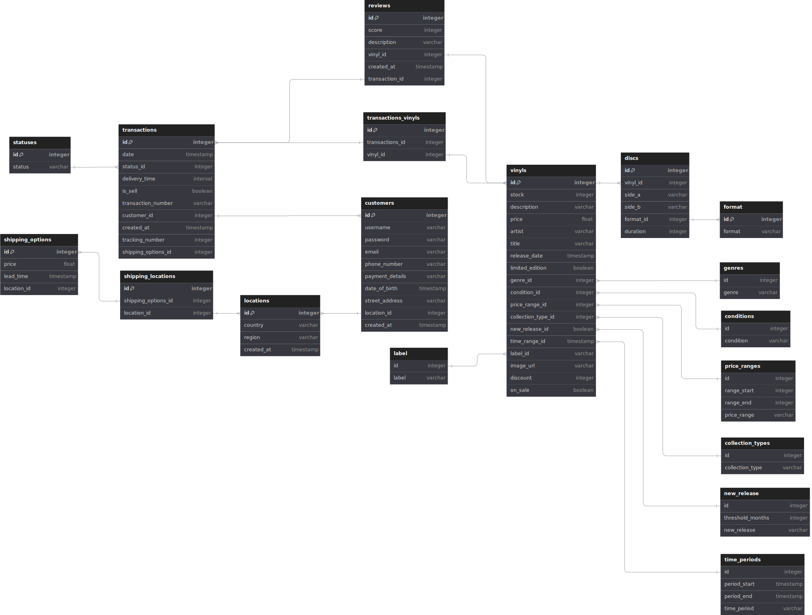

# PRO04_Back_Josh_Marika_Max
Back End For E-commerce Site Selling Vinyl Store

## Database Schema

This document describes the latest schema of the database for the vinyl records management application. The database consists of several tables representing different entities, including customers, vinyl records, reviews, and transactions.

### Schema Diagram

### Schema Breakdown

#### 1. Locations Table
- **id**: Integer, primary key.
- **country**: Varchar, country name.
- **region**: Varchar, unique region within the country.
- **created_at**: Timestamp, date and time when the location was added (default is now).

#### 2. Customers Table
- **id**: Integer, primary key.
- **username**: Varchar, the customer's username (unique).
- **password**: Varchar, the customer's password.
- **email**: Varchar, the customer's email address (unique).
- **phone_number**: Varchar, contact number for the customer.
- **payment_details**: Varchar, customer's payment details.
- **date_of_birth**: Timestamp, the customer's date of birth.
- **street_address**: Varchar, street address of the customer.
- **location_id**: Integer, references the **locations** table (not null).
- **created_at**: Timestamp, date and time when the customer was created (default is now).

#### 3. Genres Table
- **id**: Integer, primary key.
- **genre**: Varchar, genre of the vinyl (unique).

#### 4. Condition Table
- **id**: Integer, primary key.
- **condition**: Varchar, condition of the vinyl (e.g., new, used) (unique).

#### 5. Price Range Table
- **id**: Integer, primary key.
- **price_range**: Varchar, price range category (unique).

#### 6. Album or Single Table
- **id**: Integer, primary key.
- **album_or_single**: Varchar, indicates if the vinyl is an album or a single (unique).

#### 7. New Release Table
- **id**: Integer, primary key.
- **new_release**: Varchar, information about new releases (unique).

#### 8. Time Range Table
- **id**: Integer, primary key.
- **time_range**: Varchar, time range category (unique).

#### 9. Label Table
- **id**: Integer, primary key.
- **label**: Varchar, name of the record label (unique).

#### 10. Vinyls Table
- **id**: Integer, primary key.
- **stock**: Integer, number of vinyl records in stock (not null).
- **description**: Varchar, description of the vinyl.
- **price**: Float, price of the vinyl (not null).
- **artist**: Varchar, name of the artist (not null).
- **title**: Varchar, title of the vinyl (not null).
- **release_date**: Timestamp, release date of the vinyl.
- **limited_edition**: Boolean, indicates if the vinyl is a limited edition.
- **genre_id**: Integer, references the **genres** table (not null).
- **condition_id**: Integer, references the **condition** table (not null).
- **price_range_id**: Integer, references the **price_range** table (not null).
- **album_or_single_id**: Integer, references the **album_or_single** table (not null).
- **new_release_id**: Boolean, indicates if it is a new release (not null).
- **time_range_id**: Integer, references the **time_range** table (not null).
- **label_id**: Integer, references the **label** table (not null).
- **image_url**: Varchar, URL of the vinyl image.
- **discount**: Integer, discount on the vinyl.
- **on_sale**: Boolean, indicates if the vinyl is on sale (not null).

#### 11. Format Table
- **id**: Integer, primary key.
- **format**: Varchar, format of the disc (e.g., LP, EP) (unique).

#### 12. Discs Table
- **id**: Integer, primary key.
- **vinyl_id**: Integer, references the **vinyls** table.
- **side_a**: Varchar, contents of side A of the disc.
- **side_b**: Varchar, contents of side B of the disc.
- **format_id**: Integer, references the **format** table.
- **duration**: Integer, duration of the disc.

#### 13. Status Table
- **id**: Integer, primary key.
- **status**: Varchar, status of the transaction (unique).

#### 14. Transactions Table
- **id**: Integer, primary key.
- **date**: Timestamp, date of the transaction (not null).
- **status_id**: Integer, references the **status** table.
- **delivery_time**: Interval, estimated delivery time.
- **buy_or_sell**: Boolean, indicates if it is a buy or sell transaction (not null).
- **transaction_number**: Varchar, unique transaction identifier (not null).
- **customer_id**: Integer, references the **customers** table.
- **created_at**: Timestamp, date and time when the transaction was created (default is now).
- **tracking_number**: Integer, tracking number for delivery.
- **shipping_options_id**: Integer, references the **shipping_options** table.

#### 15. Reviews Table
- **id**: Integer, primary key.
- **score**: Integer, rating score given by the customer (not null).
- **description**: Varchar, review description.
- **vinyl_id**: Integer, references the **vinyls** table.
- **created_at**: Timestamp, date and time when the review was created (default is now).
- **transaction_id**: Integer, references the **transactions** table.

#### 16. Transactions Vinyls Table
- **id**: Integer, primary key.
- **transactions_id**: Integer, references the **transactions** table (not null).
- **vinyl_id**: Integer, references the **vinyls** table (not null).

#### 17. Shipping Options Table
- **id**: Integer, primary key.
- **price**: Float, price of the shipping option (not null).
- **lead_time**: Timestamp, estimated lead time for delivery.
- **location_id**: Integer, references the **locations** table.

#### 18. Shipping Locations Table
- **id**: Integer, primary key.
- **shipping_options_id**: Integer, references the **shipping_options** table.
- **location_id**: Integer, references the **locations** table.